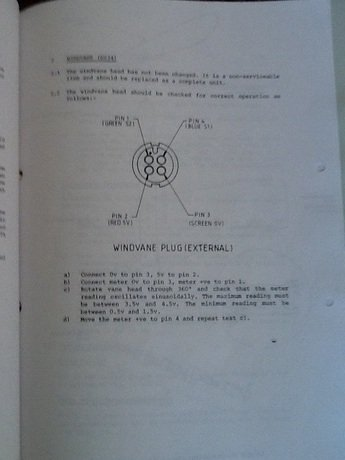

Autohelm 1000 Web Services
==========================

Autohelm 1000 (AH1000) is an autopilot for boats made by Nautech. The company was later acquired by Raymarine, and the AH1000 became the basis for Raymarines later autopilot products ST1000, and ST2000. I think my unit was produced in 1988.

Disclaimer
----------
This project is under development and has not yet been tested with the real unit at sea. Build and use this at your own risk.

Hardware
--------

AH1000 Consists of a control board, flux-gate, a daughter board of the buttons, and an actuator. Control board is connected to the daughter-board with a 10-pin ribbon cable. 4 of those pins/cables connect to the 4 pin accesory connector which is used for the wind vane and GPS navigator. Unfortunately, it is not an NMEA compatible port. The 4 pins provide 5V, GND and 2 IO Pins, let's refer to them as B1 and B2. If B1 is pulled low then it corresponds to pressing -1 button. If B1 is pulled high it corresponds to pressing -10. Similarly, if B2 is pulled low it corresponds to +1 and when it is pulled high it means +10. When the B1 and B2 pins are floating, it means no button is pressed. B1 and B2 pins are functional when the AH1000 is in Auto mode.I gathered this information from the wind vane manual. The image is very blurry however, if you look at it long enough it makes sense :)

Arduino
-------

AH1000 expects high impendence signals, and since esp8266 cannot provide 5V signals I used an arduino pro mini running at 5V to interface with the accessory port. Arduino receives the relative heading correction from the serial interface and performs necessary button presses. I used a 6 pin JST connector to interface with the AH1000. Arduino and the ESP is powered by AH1000

ESP8266
-------

esp8266 hosts a web server adn serves a simple web interface, where you can connect to it through your cell phone and remote control the AH1000. Also through the REST API it provides, it can receive heading correction from 3rd party application like signalk(this is my next project and not yet functional) or OpenCPN. ESP is powered through arduino pro mini. And information is sent to arduino through a single TX wire D4 -> RX

I placed both the arduino and the ESP into the AH1000.

